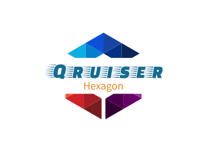

# QX HexaGon

**QX HexaGon** is a marrige between a [@greasemonkey UserScript](http://www.greasespot.net/) and a [@openstyles UserStyle](https://add0n.com/stylus.html) that gives [qruiser.com](https://www.qruiser.com/) a new cleaner layout and adding some usefull keyboard navigation shortcuts together with some usability tweaks to make the whole experience more enjoyable.

| QX HexaGon | QX HexaGon Clean | QX HexaGon Companion |
| :--------: | :--------------: | :------------------: |
|  |  |  |
| **T h e** | **B l e e d i n g** | **E d g e** |
|  |  |  |

## QX HexaGon UserStyle
A modernized theme for [qruiser.com](https://www.qruiser.com/) that rewrites the new layout using flexbox and grid containers.

### Some style highlight of QX HexaGon
* Merged **Logged in favorites** and **Favorites** widget
* Sticky sidebar sections
  * **Left sidebar**
    * Mood/Status widget
    * Favorites widget
    * Messages widget
    * Your stuff widget
  * **Right sidebar**
    * Latest logged in members widget
* Animated notifications
* SVG icons instead of the old raster images

You can have [a closer look at how it looks here](screens/screens.md#shortcuts).

#### Install [the UserStyle](https://raw.githubusercontent.com/BlackSkorpio/qx-hexagon/master/dist/css/qx-hexagon.user.css)

## QX HexaGon Companion UserScript
Fixes that goes hand in hand with the QX Hexagon userstyle.

**_The [UserScript](https://github.com/BlackSkorpio/qx-hexagon/raw/master/dist/userscript/qx-heagon-companion.user.js) is required_** to be able to enjoy the above [UserStyle](https://raw.githubusercontent.com/BlackSkorpio/qx-hexagon/master/dist/css/qx-hexagon.user.css) since here we are cleaning up a lot of the annoyencies that comes with the original layout and adding a lot of goodies!

### FIXES
* Removing the `.odd` and `.even` classes in favor for the `.qxh-flex-item` and `.qxh-grid-item`.
* Removing a lot of redundant and obsolete elements that is no longer neccesary now when using display grid and flexbox.
* Replacing all `.png` images with more modern `.svg` equilaments, these icons is even adapting there colors to the current color scheme used in profiles and clubs.

### Additions
* Adding browser titles to all pages for easy bookmarking and cleaner browser history.
* Adding source and template classes to the body tag. I.e: `.qxh-source-clubs` and `.qxh-template-clubs-scribble`.
* Adding keyboard navigation to all _important_ pages:

### Keyboard navigation
* **Basic keys**
  * **H** - Takes you directly to **_your own profilepage_**
  * **F** - Takes you to your **_current online favorites_**, or if non of them are online at the moment, it takes you to the **_all favorites_** page.
  * **V** - Takes you to the **_Your last visitors_** page
  * **C** - Takes you to the **_updated clubs page_**, if any, if no clubs is found updated it takes you the **_Your clubs page_**.
  * **X** - Clear all notifications/mark all messages as read.
* **
* **Scroll keys**
  * **Q** - Back to the top
    * **W** - Scroll upwards slowly
    * **A** - Scroll up one "page"/One viewport height
  * **E** - Down to the end
    * **S** - Scroll downwards slowly
    * **D** - Scroll down one "page"/One viewport height
* **
* **Sections Keyboard shortcuts**
  * **1** - Members Section
  * **2** - Clubs Section
  * **3** - Pictures Section
  * **4** - Movies Section
  * **5** - Blogs Section
  * **6** - Forums Section
  * **7** - Conversations Section
  * **8** - Info Section
  * **9** - Logout

#### Install HexaGon

| QX HexaGon | QX HexaGon Clean | QX HexaGon Companion |
| :--------: | :--------------: | :------------------: |
|  |  |  |
