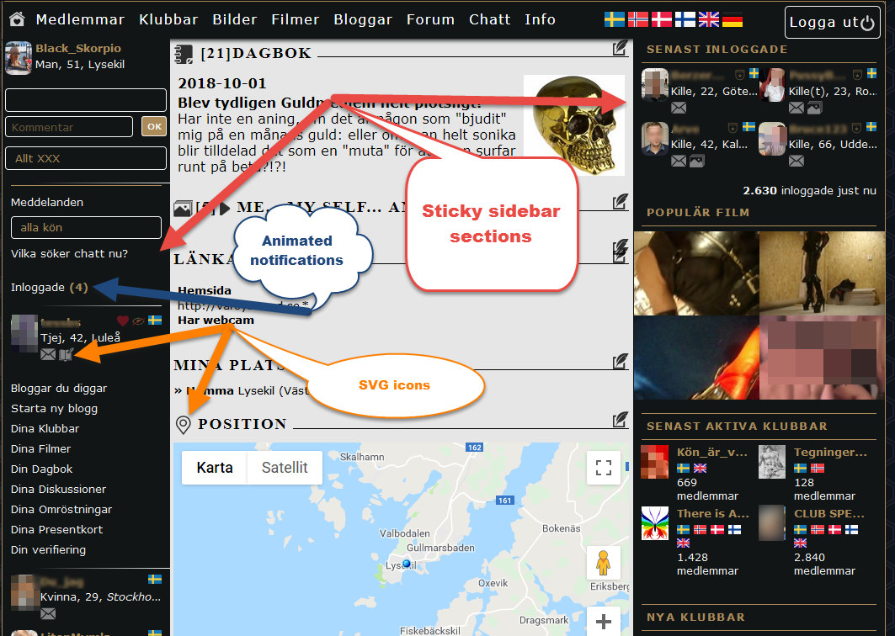
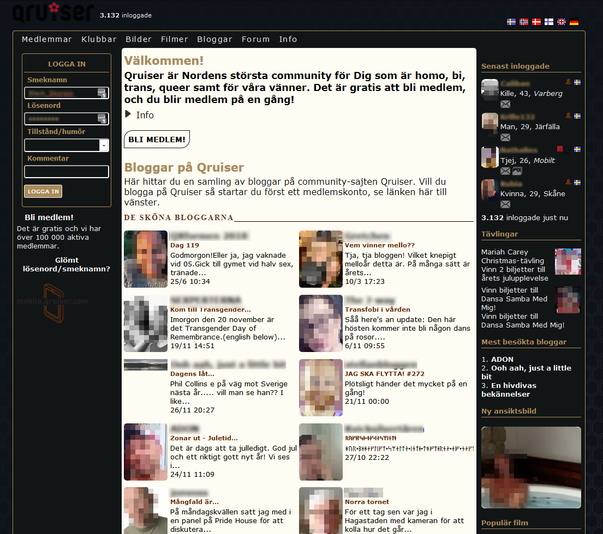
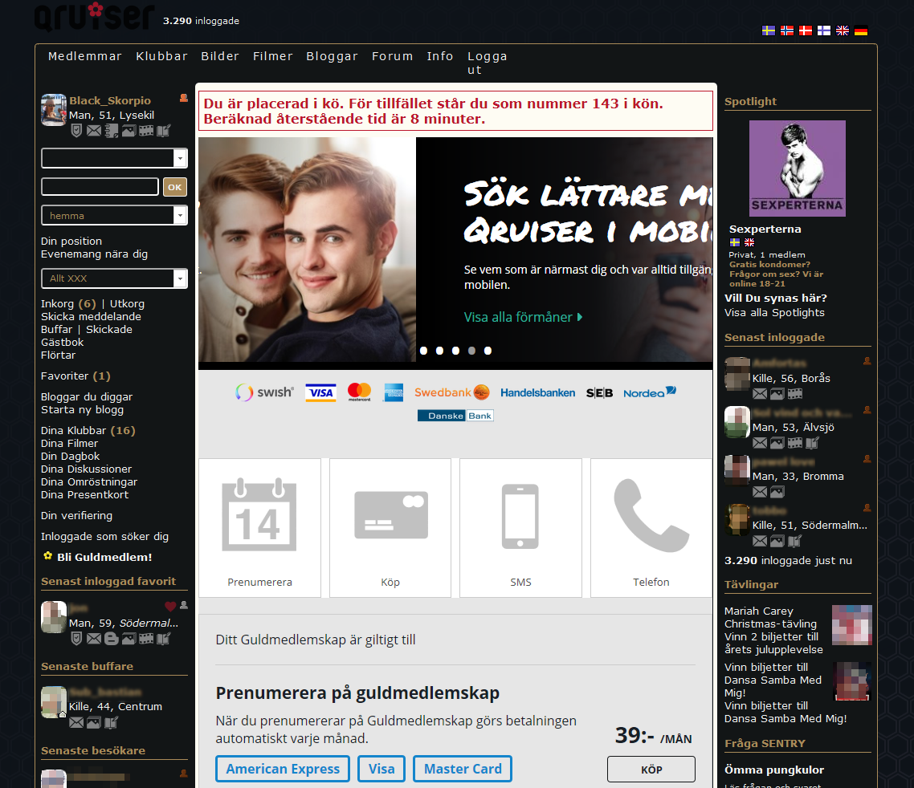
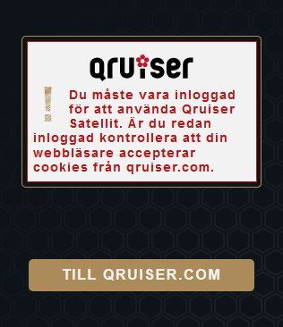
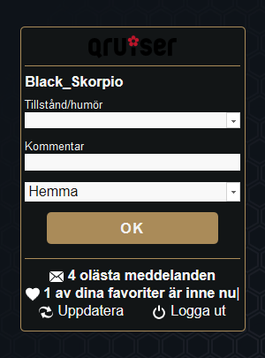
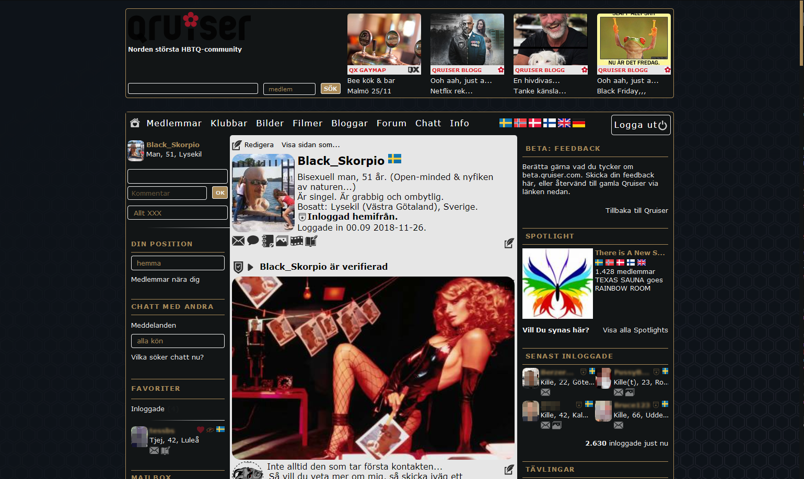
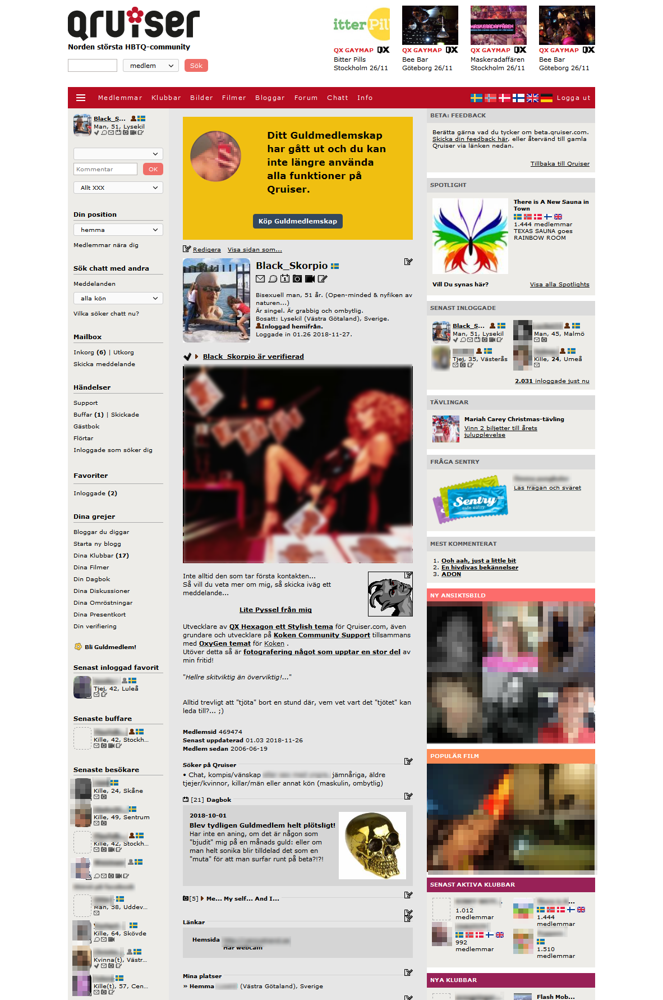
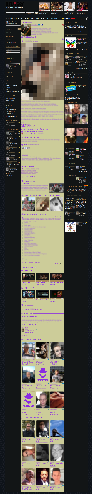
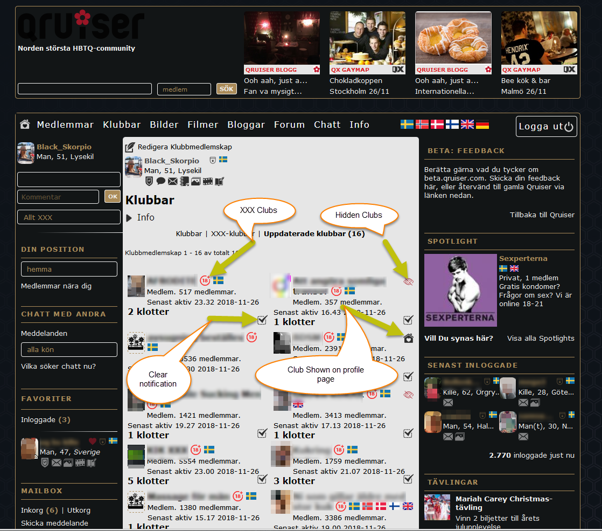

## Some highlights

**[<< Back to the docs](https://github.com/BlackSkorpio/qx-hexagon#qx-hexagon)**

## Welcome page

**[<< Back to the docs](https://github.com/BlackSkorpio/qx-hexagon#qx-hexagon)**

## When in que

## Satellite

| Satellite Not logged in | Satellite logged in |
| :---------------------: | :-----------------: |
|||

**[<< Back to the docs](https://github.com/BlackSkorpio/qx-hexagon#qx-hexagon)**

## The personal profile page

**[<< Back to the docs](https://github.com/BlackSkorpio/qx-hexagon#qx-hexagon)**

### Profile without [QX HexaGon](../README.md)

**[<< Back to the docs](https://github.com/BlackSkorpio/qx-hexagon#qx-hexagon)**

### Profile with custom colors

**[<< Back to the docs](https://github.com/BlackSkorpio/qx-hexagon#qx-hexagon)**

## Your Clubs page

**[<< Back to the docs](https://github.com/BlackSkorpio/qx-hexagon#qx-hexagon)**
